# VNShop — Multi-Seller Retail Marketplace

A polyglot microservices e-commerce platform demonstrating DDD, CQRS, hexagonal architecture, and event-driven sagas, with a React storefront on top.

VNShop is a portfolio full-stack project for a Vietnamese multi-seller marketplace inspired by Shopee, Lazada, and Tiki. It ships with: 16 services (Spring Boot + NestJS), per-service Postgres, Kafka + saga + outbox, Keycloak-backed httpOnly-cookie auth, and a React + Vite SPA. Two end-to-end test suites gate every change — `e2e-day.mjs` (55/55 API endpoints) and Playwright (19/19 browser scenarios).

## Quick Links

| Resource | Use it for |
| --- | --- |
| [Architecture doc](.sisyphus/ARCHITECTURE.md) | Full system design, bounded contexts, API conventions |
| [Status doc](.sisyphus/STATUS.md) | Per-service health, feature coverage, NFR audit, roadmap |
| [Status reality 2026-05-14](docs/STATUS-REALITY-2026-05-14.md) | Reconciliation of older gap-analysis docs against the current tree |
| [E2E audit 2026-05-18](docs/E2E-AUDIT-2026-05-18.md) | What `e2e-day.mjs` and Playwright cover, plus the bugs fixed during the buildout |
| [Latest session handover](docs/SESSION-HANDOVER-2026-05-19-pt5.md) | Most recent change set (B9 live shipping rate quote + B11 messaging WebSocket E2E) |
| [Frontend README](fe/README.md) | React + Vite SPA setup, scripts, layout |
| [Docker Compose](docker-compose.yml) | Local infrastructure and service definitions |

For a chronological view of what shipped, walk the handover series in order: `docs/SESSION-HANDOVER-2026-05-17.md` → `pt2` → `pt3` → `2026-05-18.md` → `pt2` → `pt3` → `2026-05-19-pt4.md` → `pt5`.

## Architecture Overview

```text
                    +------------------------------+
                    |   React 18 + Vite SPA        |
                    |   :3000 (docker) / :5173     |
                    |   Native /login + /register  |
                    +--------------+---------------+
                                   |
                    +--------------v---------------+
                    |  Spring Cloud Gateway        |
                    |  :8080 (Spring Boot 4)       |
                    |  CORS, JWT validation,       |
                    |  rate limit, circuit breaker |
                    +------+-------+---------------+
                           |       |
              +------------+-------+--------------+
              |            |       |              |
    +---------v----+ +----v---+ +-v----------+   |
    | Keycloak 26  | | User   | | Product    |   |
    | :8085        | | :8081  | | :8082      |   |
    | OIDC / OAuth | |Sellers,| |Catalog +   |   |
    | JWT issuer   | |native  | |reviews +   |   |
    | (vnshop      | |register| |questions   |   |
    |  realm)      | |Caffeine| |+CQRS reads |   |
    +--------------+ +---+----+ +-----+------+   |
                         |            |          |
                         |     +------v------+   |
                         |     | Order       |   |
                         |     | :8091       |   |
                         |     | Saga +      |   |
                         |     | outbox +    |   |
                         |     | projections |   |
                         |     +------+------+
                         |            |
                  +------v------+ +---v----------+
                  | Cart        | | Kafka        |
                  | :8084       | | order.* /    |
                  | NestJS      | | product.* /  |
                  | Redis-only  | | notif.* /    |
                  +-------------+ | messaging.*  |
                                  +-------+------+
                                          |
        +-----------+-------+--------+---------+----------+--------+----------+
        |           |       |        |         |          |        |          |
+-------v----+ +---v---+ +-v-----+ +v-------+ +v--------+ +v------+ +v-------+
|Search      | |Notif. | |Inv.   | |Pay     | |Shipping | |Recs   | |Messag- |
|:8086       | |:8087  | |:8083  | |:8092   | |:8093    | |:8094  | |ing :8095|
|Spring Boot | |NestJS | |Stock +| |VNPAY/  | |Carrier  | |Spring | |NestJS  |
|Elasticsearch||+Kafka | |flash  | |MoMo    | |+ tracking|Boot   | |+WebSocket|
+------------+ +-------+ +-------+ +--------+ +---------+ +-------+ +--------+

         Seller Finance (:8090, Spring Boot) — wallet + payouts
         Coupon (:8088, profile=legacy) — superseded by order-service in app profile
         Review (profile=apps) — kept for backwards compatibility; review APIs are owned by product-service
```

## Project Status

Two end-to-end gates run green at the current HEAD:

| Suite | Result | Coverage |
| --- | --- | --- |
| `node infra/scripts/e2e-day.mjs` | **55/55 PASS** | Single-day flow: register → login (buyer/seller/admin) → catalog → public sellers → seller fulfilment → cart → wishlist → checkout (live shipping rate quote) → order → coupon validate + apply → admin seller approval → saga compensation (cancel + return + refund) → messaging WebSocket handshake → reviews + Q&A → recommendations → admin dashboards → user profile |
| `cd fe && npx playwright test` | **19/19 PASS** | Real browser against dockerised FE: smoke, buyer happy path, authenticated routes, role guards, search, public sellers, guest cart |

Plus per-service unit tests: user-service 107/107, product-service 25/25, FE vitest 143/143.

### Recent shipped (2026-05-18 → 2026-05-19)

- **Messaging WebSocket E2E coverage** (B11). Three handshake scenarios on `/ws/messaging` (valid token → hello frame, missing token → close, garbage token → close). Surfaced + fixed a missing-Kafka-topic crash that had silently kept messaging-service down.
- **Live shipping rate quote** (B9). New `POST /shipping/rate-quotes` on shipping-service returns multi-carrier options (GHN STANDARD + GHTK EXPRESS via the stub). order-service `/checkout/shipping-options` now pulls live rates with graceful degradation to the legacy STANDARD-only fallback.
- **httpOnly cookie auth.** Refresh token left localStorage; lives in the `vnshop_rt` cookie issued by user-service `/auth/login` (httpOnly, SameSite=Lax, Path=/auth, configurable Secure). Access token is JS-memory-only. user-service hosts a thin /auth proxy with login/refresh/logout; KC realm config unchanged.
- **Saga compensation E2E** drives cancel-before-fulfilment + return + refund through the saga + outbox + projection cycle. Surfaced + fixed a long-dormant V18 audit-columns bug on the returns table.
- **Cart guest mode + merge-on-login.** Anonymous users get a localStorage cart at `vnshop:guest-cart`; one-shot replay on first authenticated render mirrors the wishlist pattern.
- **Coupon validate + apply E2E** (B3) and **admin seller approval E2E** (S2) both closed deferred items.
- **Public sellers** wired end-to-end with batched stats endpoints + Caffeine caching + Resilience4j circuit breaker + retry on user-service.
- **Pagination headers**: `GET /sellers` emits `X-Total-Count` + RFC 5988 `Link` (rel=prev/next).
- **Bean validation** on `RegisterSellerRequest` (`@NotBlank`, `@Size`, `@Pattern` on bankAccount).

### Deferred / not yet wired (next-leverage)

From `docs/SESSION-HANDOVER-2026-05-19-pt5.md`:

- VNPAY / MOMO IPN end-to-end (needs a mock provider service to drive without a real PSP) — largest deferred BE flow.
- Notifications inbox (no inbox endpoint or FE bell yet; Kafka consumer exists).
- Real GHN/GHTK adapter for shipping rate quote (B9 shipped the stub + pluggable port; live adapter needs API key wiring).
- Native password reset / 2FA (currently bounce out to Keycloak's account console).
- Email verification flow (currently `emailVerified: true` set on register).
- Hero/promo/trending CMS for HomePage (stubs in place via `<ComingSoonCard>`).

### Service ownership at HEAD

```mermaid
flowchart TB
  GW[api-gateway :8080]
  KC[Keycloak :8085]
  FE[frontend :3000]

  subgraph CoreSpringBoot
    U[user-service :8081]
    P[product-service :8082]
    O[order-service :8091]
    I[inventory-service :8083]
    S[search-service :8086]
    PAY[payment-service :8092]
    SHIP[shipping-service :8093]
    SF[seller-finance :8090]
    R[recommendations :8094]
  end

  subgraph NestJS
    C[cart-service :8084]
    N[notification-service :8087]
    M[messaging-service :8095]
  end

  FE --> GW
  GW --> KC
  GW --> U & P & O & I & C & S & N & PAY & SHIP & SF & R & M

  U --> SellerProfile[Buyers, sellers, addresses, wishlist, native /auth/register]
  P --> Catalog[Catalog, variants, images, reviews, questions, public seller stats batch]
  O --> Commerce[Orders, sub-orders, checkout, coupons, saga, outbox, payouts, finance]
  I --> Stock[Stock, reservations, flash sale]
  C --> Cart[Redis cart + cart-service round-trip]
  S --> Search[Elasticsearch index + faceted search]
  N --> Notify[Email, SMS, push, in-app via Kafka]
  M --> Chat[Buyer-seller chat, REST + WebSocket]
  PAY --> Payments[Intent + reconciliation; VNPAY/MoMo surface]
  SHIP --> Shipping[Shipment creation + tracking]
  SF --> Wallet[Seller wallet + payouts]
  R --> Recs[Frequently-bought-together via co-purchase aggregator]
```



## Tech Stack

| Area | Technology |
| --- | --- |
| Java services | Java 25 LTS, Spring Boot 4.0.6, Spring Cloud Gateway, Maven 3.9 |
| Node services | Node.js 24 LTS, NestJS 11 |
| Frontend | React 18.3, Vite 6.3, TanStack Query 5, react-router 7, i18next 26, zod 4, Tailwind v4 |
| Identity | Keycloak 26.6 (`vnshop` realm), OIDC / OAuth2, JWT, ROPC for native login |
| Data stores | PostgreSQL 17.9 (per-service), Redis 8.6, Elasticsearch 9.4.0, MinIO (S3-compatible) |
| Messaging | Kafka (`confluentinc/cp-kafka:8.2.0`) |
| Observability | Jaeger (OTLP traces), Prometheus + Alertmanager |
| Resilience | Resilience4j circuit breaker + retry, Caffeine cache (user-service stats adapter) |
| Quality | JaCoCo (Java), vitest + Playwright (FE), Jest (NestJS) |
| Runtime | Docker, Docker Compose |

## Quick Start

Stand up everything (infrastructure + 13 app services + frontend):

```bash
docker compose --profile apps up -d
```

One-time post-import setup for Keycloak admin client (idempotent):

```bash
bash infra/scripts/setup-keycloak-admin-client.sh
```

Pre-create Kafka consumer-side topics so messaging-service doesn't crash on startup (idempotent; runs `kafka-topics --create --if-not-exists`):

```bash
bash infra/scripts/init-kafka-topics.sh
```

Seed the demo catalog so the storefront has products to render (skips when catalog is non-empty; `FORCE=1` to overwrite):

```bash
node infra/scripts/seed-demo.mjs
```

Verify the stack is healthy with both gates:

```bash
node infra/scripts/e2e-day.mjs       # 52/52 — day-in-the-life API smoke
cd fe && npx playwright test         # 19/19 — real browser FE-to-BE
```

If you see 503s on either suite, Spring Cloud Gateway's Resilience4j breaker has latched. Reset with `docker compose restart api-gateway`.

### Local access points

| URL | What opens |
| --- | --- |
| `http://localhost:3000` | Storefront SPA (React + Vite, dockerised bundle) |
| `http://localhost:5173` | Storefront SPA (Vite dev server, optional alternative) |
| `http://localhost:8080` | API gateway |
| `http://localhost:8085` | Keycloak admin console |
| `http://localhost:9200` | Elasticsearch |
| `http://localhost:16686` | Jaeger UI |
| `http://localhost:9000` | MinIO console |
| `http://localhost:9093` | Alertmanager |

### Default credentials

| System | Username | Password |
| --- | --- | --- |
| Keycloak admin | `admin` | `admin` |
| PostgreSQL (all per-service DBs) | `vnshop` | `vnshop` |
| MinIO root | `minioadmin` | `minioadmin` |

### Test users (Keycloak realm `vnshop`, all password `test`)

- `buyer1` — BUYER role
- `seller1` — SELLER role (also has BUYER)
- `admin1` — ADMIN role (also has BUYER)

`/auth/register` creates additional fresh users at runtime; the E2E suite generates `e2e_buyer_<timestamp>@vnshop.local` accounts each run.

### Common service ports

```text
3000 frontend (docker)
5173 frontend (vite dev)
8080 api-gateway
8081 user-service
8082 product-service
8083 inventory-service
8084 cart-service
8085 keycloak
8086 search-service
8087 notification-service
8088 coupon-service          (profile: legacy)
8090 seller-finance-service
8091 order-service
8092 payment-service
8093 shipping-service
8094 recommendations-service
8095 messaging-service
```

### Per-service Postgres

```text
5432 postgres-legacy        (notification, coupon, seller-finance, recommendations, messaging schemas)
5433 postgres-user
5434 postgres-product
5435 postgres-order
5436 postgres-payment
5437 postgres-inventory
5438 postgres-search
5439 postgres-shipping
```

Stop the stack:

```bash
docker compose --profile apps down
```

## Service Map

| Service | Port | Tech | Profile | Owns |
| --- | ---: | --- | --- | --- |
| frontend | 3000 | React 18 + Vite 6 | apps | Storefront SPA, native `/login` + `/register`, role-gated routes |
| api-gateway | 8080 | Spring Boot, Spring Cloud Gateway | apps | Edge routing, OAuth2 resource server, CORS, rate limiting, circuit breakers |
| user-service | 8081 | Spring Boot | apps | Buyer + seller profiles, addresses, wishlist, native `/auth/register`, public seller endpoints (`GET /sellers`, `GET /sellers/{id}`) |
| product-service | 8082 | Spring Boot | apps | Seller catalog, categories, variants, product images, reviews, questions, batch seller stats endpoints |
| inventory-service | 8083 | Spring Boot | apps | Stock levels, reservations, flash sale inventory |
| cart-service | 8084 | NestJS | apps | Redis cart snapshots, buyer cart operations |
| search-service | 8086 | Spring Boot | apps | Elasticsearch search index, faceted queries |
| notification-service | 8087 | NestJS | apps | Kafka-driven email, SMS, push, in-app workflows |
| coupon-service | 8088 | Spring Boot | legacy | Coupon validate/apply (superseded by order-service in app profile) |
| seller-finance-service | 8090 | Spring Boot | apps | Seller wallet, payouts, transactions |
| order-service | 8091 | Spring Boot | apps | Orders, sub-orders, checkout, coupons (in-process), saga orchestration, outbox, finance projections |
| payment-service | 8092 | Spring Boot | apps | Payment intents, VNPAY/MoMo surface, reconciliation |
| shipping-service | 8093 | Spring Boot | apps | Shipment creation, carrier integration, tracking |
| recommendations-service | 8094 | Spring Boot | apps | Frequently-bought-together via co-purchase aggregator |
| messaging-service | 8095 | NestJS | apps | Buyer-seller direct messaging (REST + WebSocket fan-out) |
| review-service | — | Spring Boot | apps | Backwards-compat shell; review APIs are owned by product-service |

## Architecture Patterns

VNShop uses four core patterns together:

| Pattern | How VNShop uses it |
| --- | --- |
| Domain-Driven Design | Each bounded context owns its language, aggregates, use cases, and Postgres schema |
| Hexagonal | Domain + application depend on ports. Spring/NestJS/JPA/Kafka live in adapters |
| CQRS | Order-service has order summary projection; product-service serves read-side queries; sellers expose batch read endpoints |
| Event-driven saga | Order, payment, inventory, shipping, notification, messaging flows publish + consume Kafka events; saga orchestrator + outbox + projections handle compensation |

### Hexagonal flow

```text
                 inbound adapters
          REST controllers, Kafka consumers
                       |
                       v
+------------------------------------------------+
| application layer                              |
| use cases, commands, queries, ports            |
+----------------------+-------------------------+
                       |
                       v
+------------------------------------------------+
| domain layer                                   |
| aggregates, value objects, domain services     |
| no Spring, NestJS, JPA, Kafka, or HTTP imports |
+----------------------+-------------------------+
                       |
                       v
                 outbound ports
       repositories, event publishers, gateways
                       |
                       v
                outbound adapters
       JPA, Redis, Kafka, Keycloak, RestClient, gRPC
```

When adding behavior, start in the domain model, expose it through an application use case, then connect adapters last.

## Production characteristics now in place

- **httpOnly cookie auth.** Refresh tokens live in the `vnshop_rt` cookie (HttpOnly, SameSite=Lax, Path=/auth, configurable Secure) issued by user-service. Access tokens are JS-memory-only. XSS can't bootstrap a new session.
- **Resilience4j** circuit breaker + retry on the user-service → product-service stats adapter (sliding window 10, failure rate 50%, 10s open, 3 half-open trial, 3-attempt retry with 200ms exponential backoff).
- **Caffeine** in-memory cache on the same adapter (5-minute TTL, 10k entries, `recordStats()` enabled).
- **Pinned timeouts** on outbound HTTP — 1s connect / 2.5s read via shared `JdkClientHttpRequestFactory`.
- **Batch endpoints** kill N+1 on the SellerShowcase: `POST /reviews/seller-summaries` and `POST /products/counts` (≤100 ids each).
- **Cart guest mode** — anonymous users get a localStorage cart at `vnshop:guest-cart`; one-shot replay on first authenticated render preserves items across login.
- **Saga compensation E2E coverage** — cancel-before-fulfilment + return + refund driven through the saga + outbox + projection cycle.
- **Kafka producers** declare explicit `JsonSerializer` for record payloads (default `StringSerializer` would silently drop them).
- **JSONB** columns use `@JdbcTypeCode(SqlTypes.JSON)` (the `columnDefinition = "jsonb"` only affects schema generation).
- **Audit columns** (`created_at`, `updated_at`) on all core tables (V17 + V18); saga and outbox have stable order numbers across restarts (millisecond-of-day prefix).
- **CORS** explicit on the gateway (`CorsConfigurationSource` bean + `setAllowCredentials(true)` for the cookie flow + `permitAll` on OPTIONS for `/**`).
- **Health probes** exposed via `/actuator/health` with `circuitbreakers` contributor enabled; Prometheus endpoint available.

See [`docs/SESSION-HANDOVER-2026-05-19-pt4.md`](docs/SESSION-HANDOVER-2026-05-19-pt4.md#operational-gotchas--durable-rules--additions-to-the-pt3-list) for the durable rules learned along the way (Hibernate 7 single-row aggregate wrapping, Spring 4 PathPattern regex limits, AOP-only `@CircuitBreaker`, `@MappedSuperclass` retroactivity, cookie-based auth needing `credentials: "include"` on every call, etc.).

## Coding Convention

Follow these guardrails across services:

| Area | Rule |
| --- | --- |
| Java DTOs | Use `record`, not mutable classes — applies to commands, requests, responses, queries |
| JPA entities | Use Lombok `@Getter`/`@Setter` |
| JPA repositories | Two-layer adapter: `*JpaRepository implements Port` wraps `*SpringDataRepository extends JpaRepository` |
| Domain layer | Zero framework imports — no Spring, NestJS, JPA, Kafka, HTTP, or persistence annotations |
| Tests | 90% target coverage, JaCoCo (Java), vitest (FE), Jest (NestJS) |
| API responses | Return the shared `ApiResponse<T>` envelope (`{success, message, data, errorCode, timestamp}`) |
| Validation | Bean validation on inbound DTOs (`@Valid`, `@NotBlank`, `@Size`, `@Pattern`) |
| Outbound HTTP | Pinned connect/read timeouts; circuit breaker + retry where the call is in the user-facing path |
| Git | Conventional commits; name the affected bounded context in PR descriptions |

## Project Structure

```text
services/
  api-gateway/             # Spring Cloud Gateway (8080)
  user-service/            # Buyers, sellers, native auth (8081)
  product-service/         # Catalog + reviews + batch stats (8082)
  inventory-service/       # Stock + flash sales (8083)
  cart-service/            # NestJS Redis cart (8084)
  search-service/          # Elasticsearch (8086)
  notification-service/    # NestJS email/SMS/push (8087)
  coupon-service/          # Legacy profile (8088)
  seller-finance-service/  # Wallet + payouts (8090)
  order-service/           # Orders, checkout, saga, finance (8091)
  payment-service/         # VNPAY/MoMo surface (8092)
  shipping-service/        # Carrier integration (8093)
  recommendations-service/ # Co-purchase recs (8094)
  messaging-service/       # NestJS chat REST + WS (8095)
  review-service/          # Backwards-compat shell
fe/                        # React + Vite SPA
infra/
  scripts/
    e2e-day.mjs            # 35-step day-in-the-life API suite
    seed-demo.mjs          # Demo catalog seeder
    setup-keycloak-admin-client.sh
    backup.sh / restore.sh
  k8s/                     # K8s + Helm scaffolding
  prometheus/              # Metrics + alert rules
docs/                      # Status reality, audits, session handovers
.sisyphus/                 # Architecture + status canonicals
```

## How to Develop

1. Read [`.sisyphus/ARCHITECTURE.md`](.sisyphus/ARCHITECTURE.md) before changing service boundaries, domain rules, or integration flows.
2. Read the latest session handover in [`docs/`](docs/) for the most recent change set, durable rules, and known issues.
3. Start with the domain model. Add or change value objects, aggregate methods, and domain services before touching controllers or persistence.
4. Add application use cases around domain behavior. Depend on ports, not adapters.
5. Add outbound adapters only after the port contract is clear. Pin timeouts and add circuit breakers where the call sits in the user path.
6. Add inbound adapters last (REST controllers, Kafka consumers, WebSocket gateways).
7. Run focused tests for the service you changed, then both E2E gates before merging:
   ```bash
   node infra/scripts/e2e-day.mjs       # API
   cd fe && npx playwright test         # browser
   ```
8. Update the session handover when behavior, ports, setup, or service ownership changes.

## How to Contribute

1. Pick one bounded context and read its section in the architecture doc.
2. Read the latest session handover for known issues, deferred items, and durable rules.
3. Follow the coding conventions above before writing code.
4. Keep the domain layer framework-free.
5. Add or update tests with every behavior change. Both E2E suites must stay green.
6. Update the relevant doc in `docs/` when your change affects setup, service ownership, APIs, or architecture.
7. In PR descriptions, state which bounded context changed, which gates you ran, and any deferred follow-ups.

Good first contributions are small, bounded, and covered by tests: a missing use case, a DTO cleanup, a repository adapter fix, a service-specific test, or a doc update that helps the next contributor.
