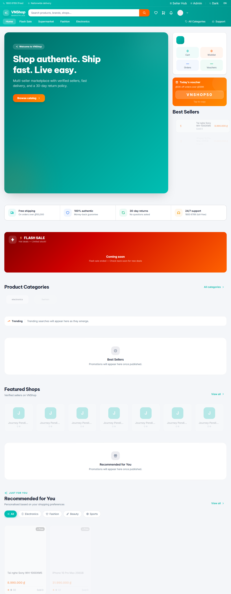
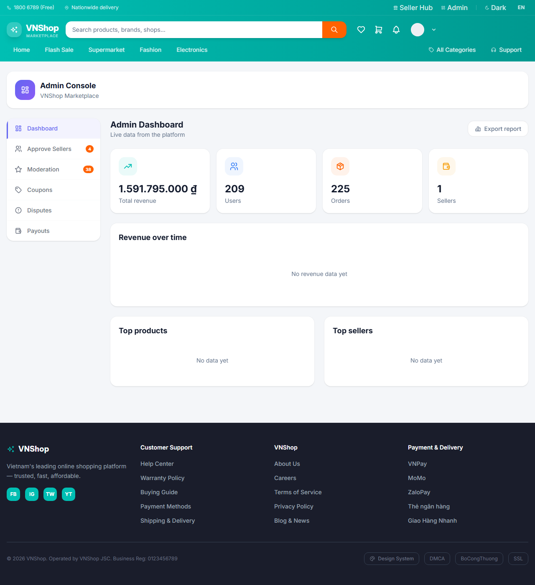
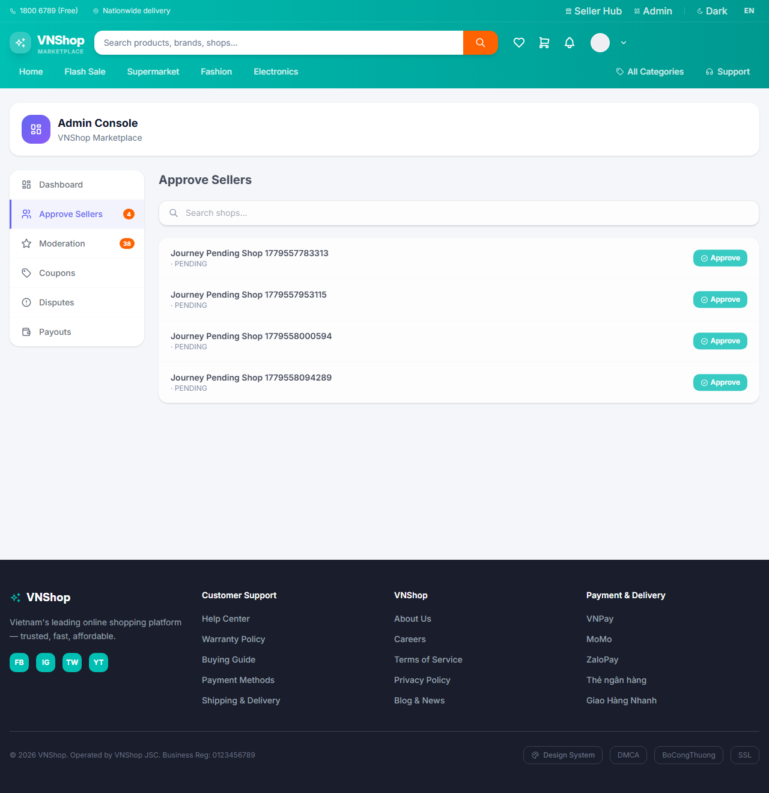
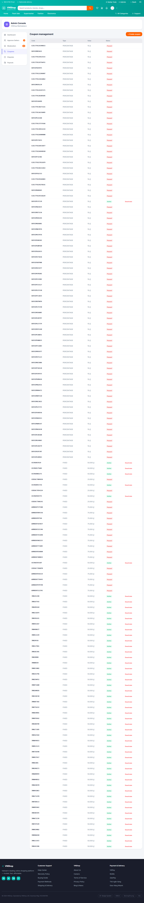
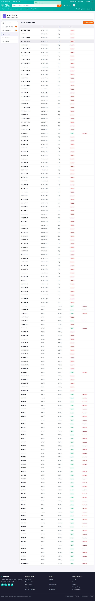
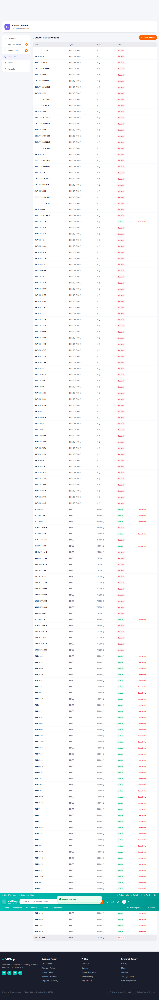
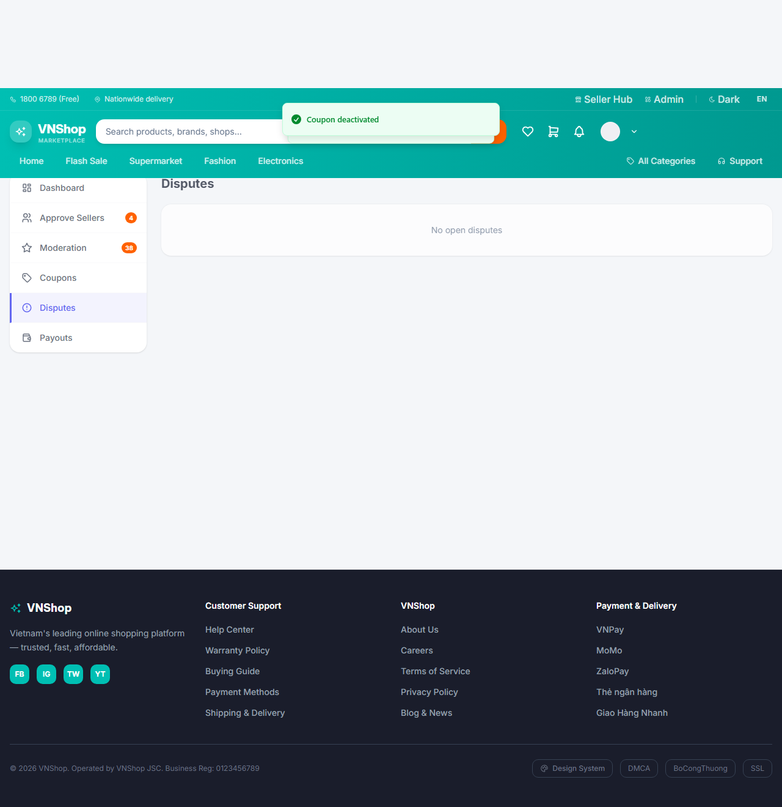
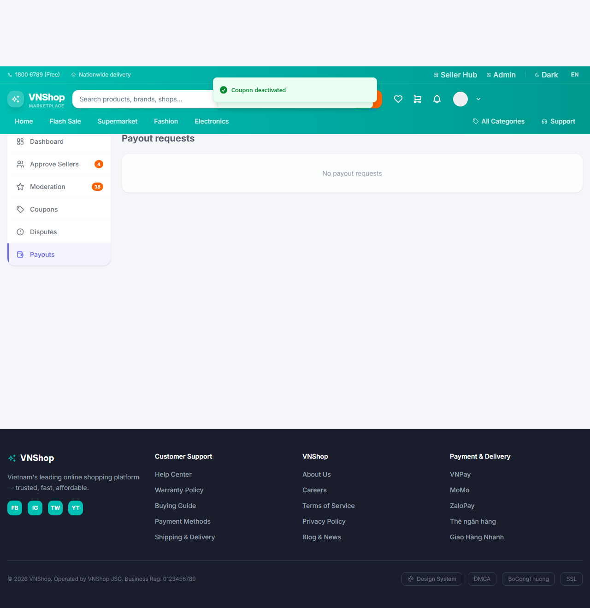
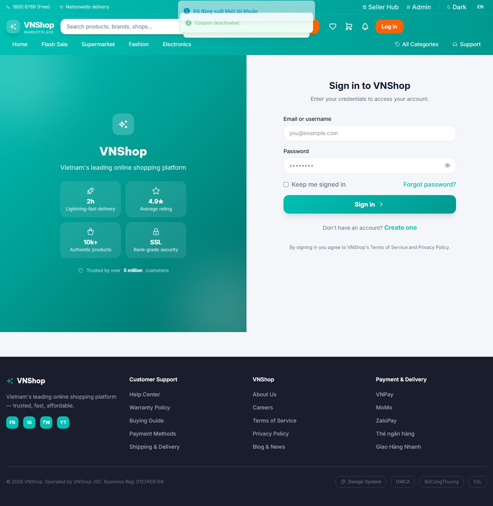

# Workday — Admin

**Verdict:** PASS
**Steps:** 9 / 9 passed
**Generated:** 2026-05-24T08:13:35.621Z

## Steps

### 01. Login as admin1 via /login form — PASS

### 02. /admin dashboard mounts as default tab — PASS

### 03. Sellers approval queue renders — PASS

### 04. Open Coupons tab — PASS

### 05. Create FIXED coupon WORKDAY409012 round-trips — PASS

### 06. Deactivate coupon WORKDAY409012 flips to Paused — PASS

### 07. Disputes tab parses — PASS

### 08. Payouts tab parses — PASS

### 09. Logout returns to home with Login CTA — PASS

## Artifacts

- `trace.zip` — open with `npx playwright show-trace trace.zip`
- `video.webm` — full session recording (gitignored)
- `screenshots/` — one `NN-slug.png` per step, regenerated each run
