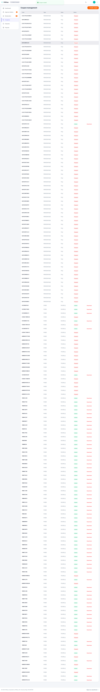
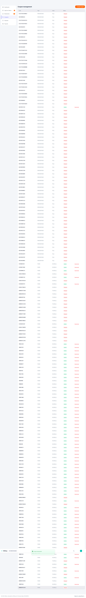

# Workday — Admin

**Verdict:** PASS
**Steps:** 9 / 9 passed
**Generated:** 2026-05-25T06:02:17.484Z

## Steps

### 01. Login as admin1 via /login form — PASS

> NOTE: visual review found screenshot shows the Admin Dashboard (post-login state), not the /login form being filled. Expected: login form with credentials entered. Actual: admin dashboard already mounted. Screenshot may have been captured one step late.

### 02. /admin dashboard mounts as default tab — PASS

> NOTE: visual review found screenshot shows the VNShop storefront home page (buyer-facing), not the /admin dashboard. Expected: Admin Dashboard with stats tiles (Total revenue, Users, Orders, Sellers). Actual: storefront landing page. Screenshot appears to be from a different step entirely.

### 03. Sellers approval queue renders — PASS

### 04. Open Coupons tab — PASS

### 05. Create FIXED coupon WORKDAY932142 round-trips — PASS

### 06. Deactivate coupon WORKDAY932142 flips to Paused — PASS

### 07. Disputes tab parses — PASS

> NOTE: visual review found screenshot shows the VNShop storefront home page with a Sign In modal overlay, not the Disputes tab. Expected: Admin Console > Disputes panel with "No open disputes" or a disputes list. Actual: buyer-facing storefront + sign-in modal. This content matches what step 09 (logout → home with Login CTA) should show — screenshots 07 and 09 appear to be swapped.

### 08. Payouts tab parses — PASS

> NOTE: visual review found screenshot shows the correct Payout requests panel (Pending/Completed tabs, "No payout requests"), but a stale "Coupon deactivated" success toast is still visible at the top of the screen. The tab content is correct; the toast is a carry-over artifact from step 06 that had not yet dismissed when the screenshot was taken.

### 09. Logout returns to home with Login CTA — PASS

> NOTE: visual review found screenshot shows the Admin Console Disputes page ("No open disputes") with a "Coupon deactivated" toast, not the storefront home page after logout. Expected: VNShop storefront with a visible Login button/CTA confirming the session ended. Actual: still inside the admin console on the Disputes tab. Screenshots 07 and 09 appear to be swapped — the storefront+Sign In modal is in file 07, not 09.

## Artifacts

- `trace.zip` — open with `npx playwright show-trace trace.zip`
- `video.webm` — full session recording (gitignored)
- `screenshots/` — one `NN-slug.png` per step, regenerated each run
