# Workday — Buyer

**Verdict:** PASS
**Steps:** 15 / 15 passed
**Generated:** 2026-05-23T17:25:32.850Z

## Steps

### 01. Cold-load home page — PASS

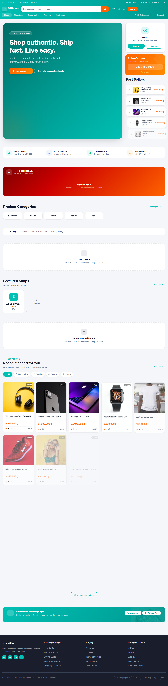

### 02. Switch language EN to VI — PASS

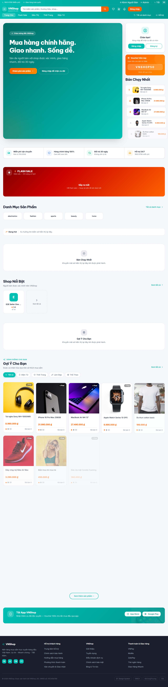

### 03. Toggle dark mode on — PASS

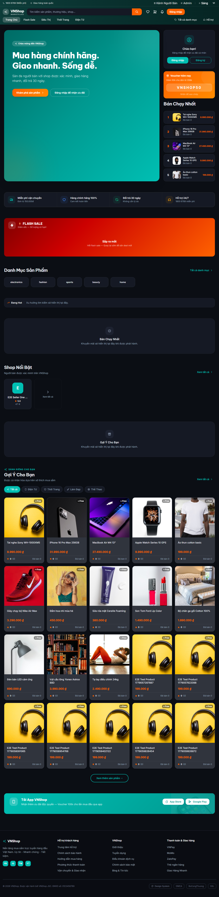

### 04. Pull a real seeded product for the journey — PASS

### 05. Open product detail from URL — PASS

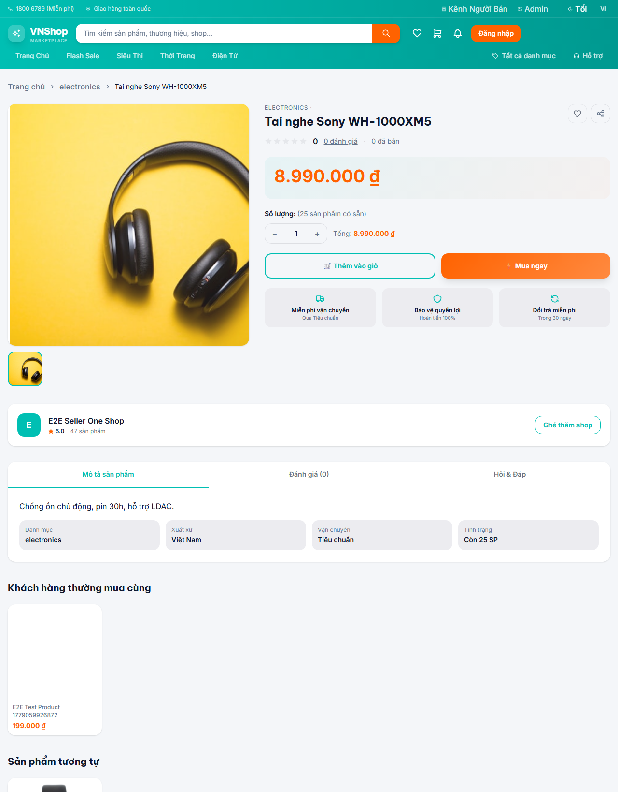

### 06. Guest add-to-cart blocks with login toast — PASS

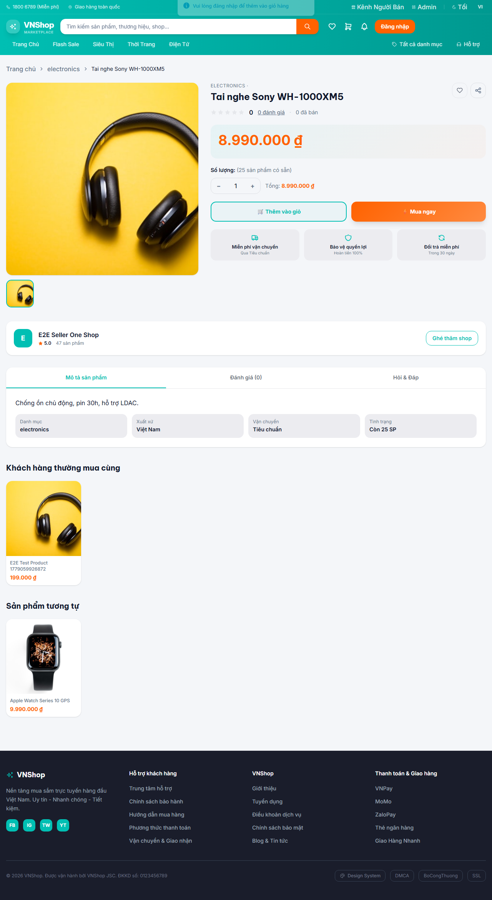

### 07. Register fresh buyer via /register form — PASS

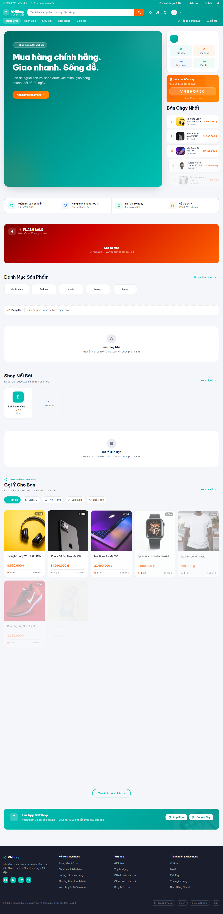

### 08. Authed add-to-cart from product detail — PASS

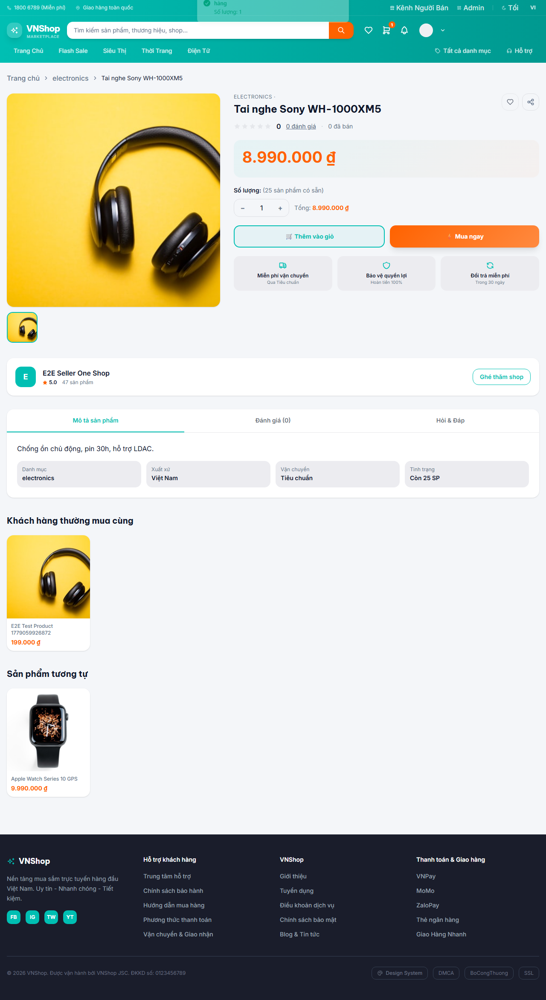

### 09. Cart shows real product name and non-zero VND total — PASS

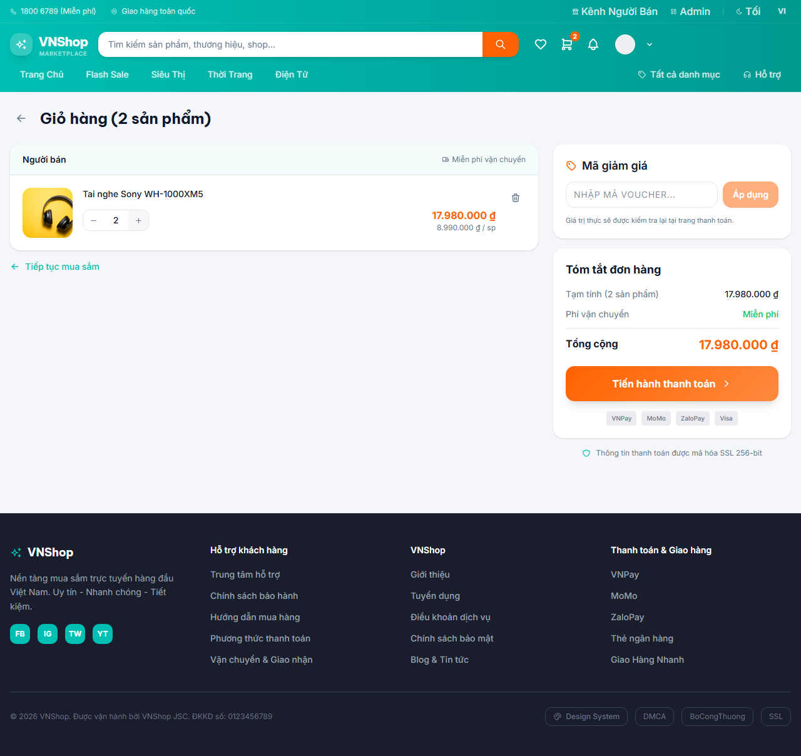

### 10. Toggle wishlist heart on product detail — PASS

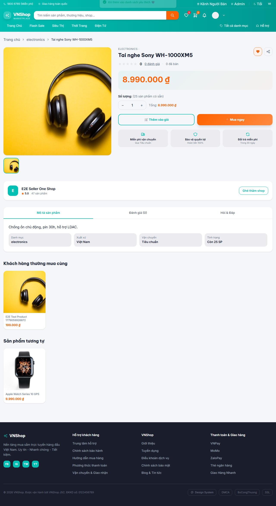

### 11. Add a default address via Profile → Addresses — PASS

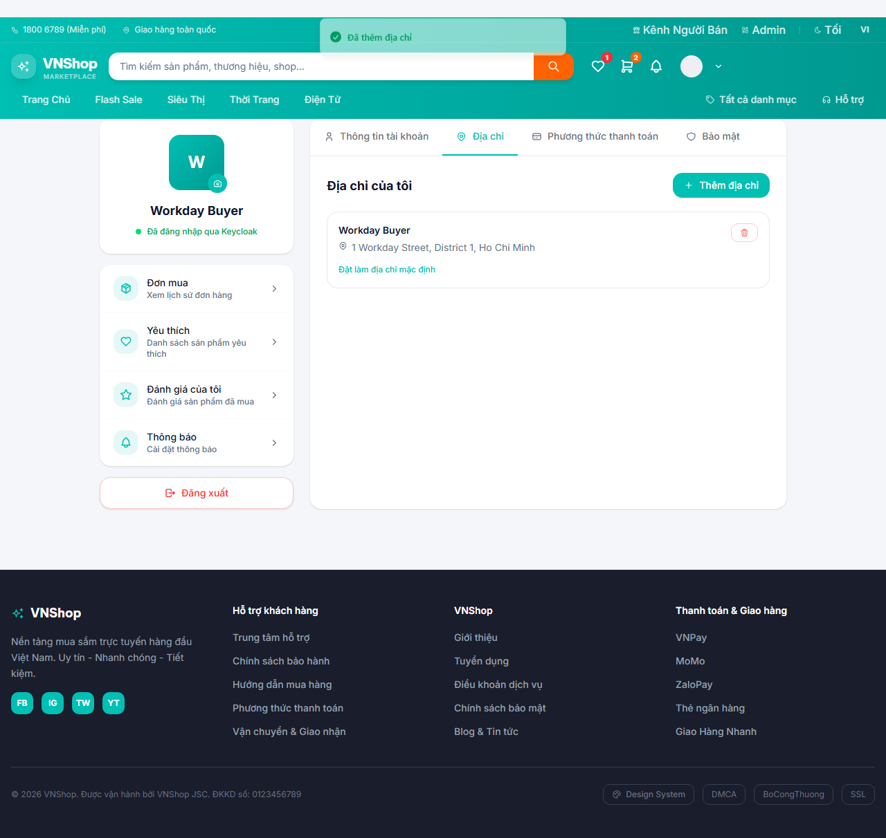

### 12. Checkout 4-step panel renders with new address — PASS

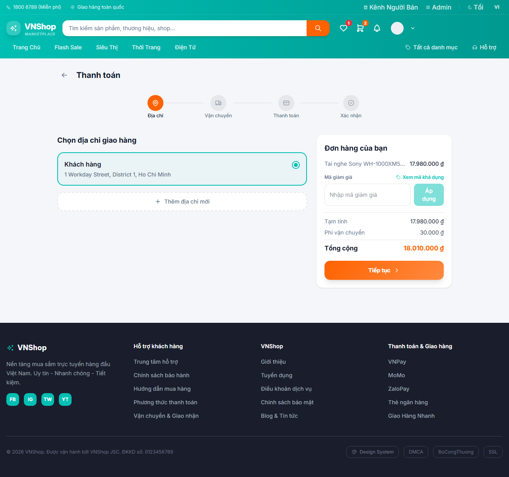

### 13. Place a COD order via the API and view it in /orders — PASS

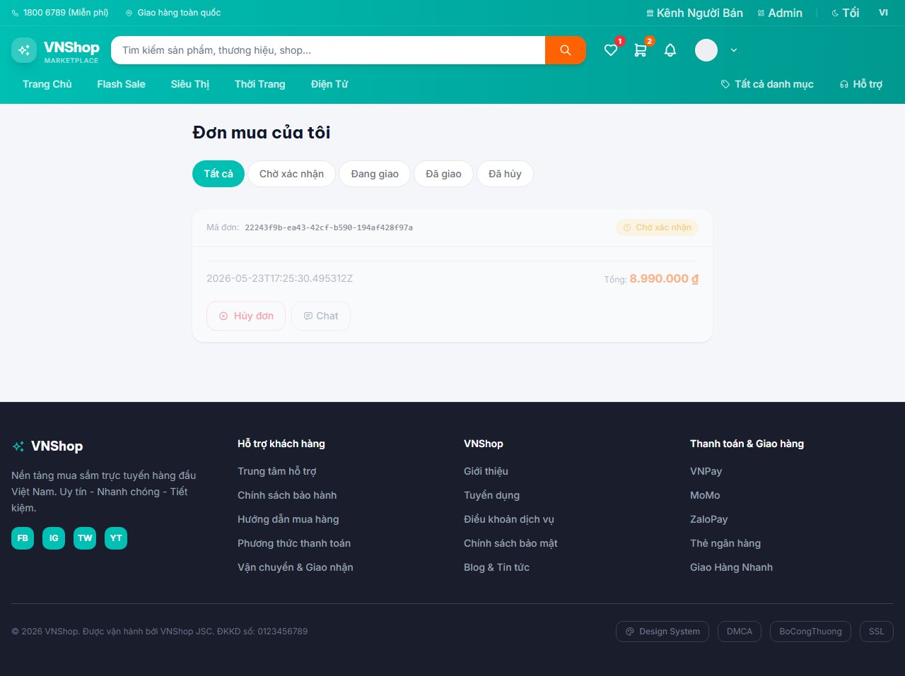

### 14. Cancel pending order via the UI button — PASS

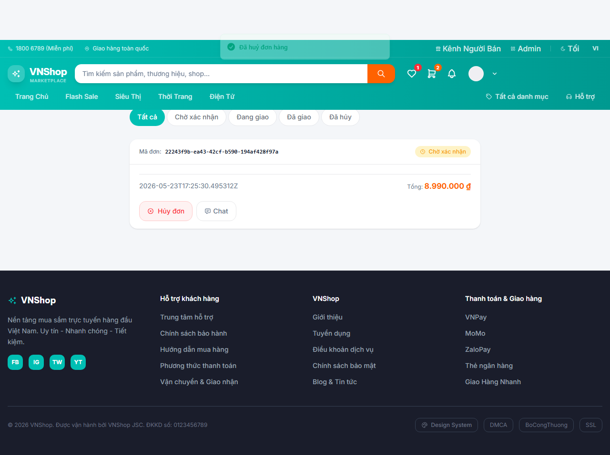

### 15. Logout returns to home with the Login CTA — PASS

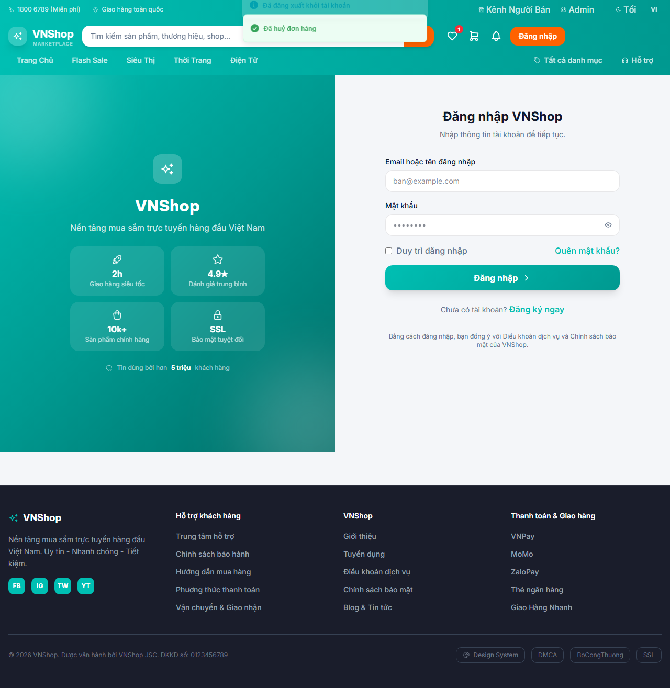

## Artifacts

- `trace.zip` — open with `npx playwright show-trace trace.zip`
- `video.webm` — full session recording (gitignored)
- `screenshots/` — one `NN-slug.png` per step, regenerated each run
