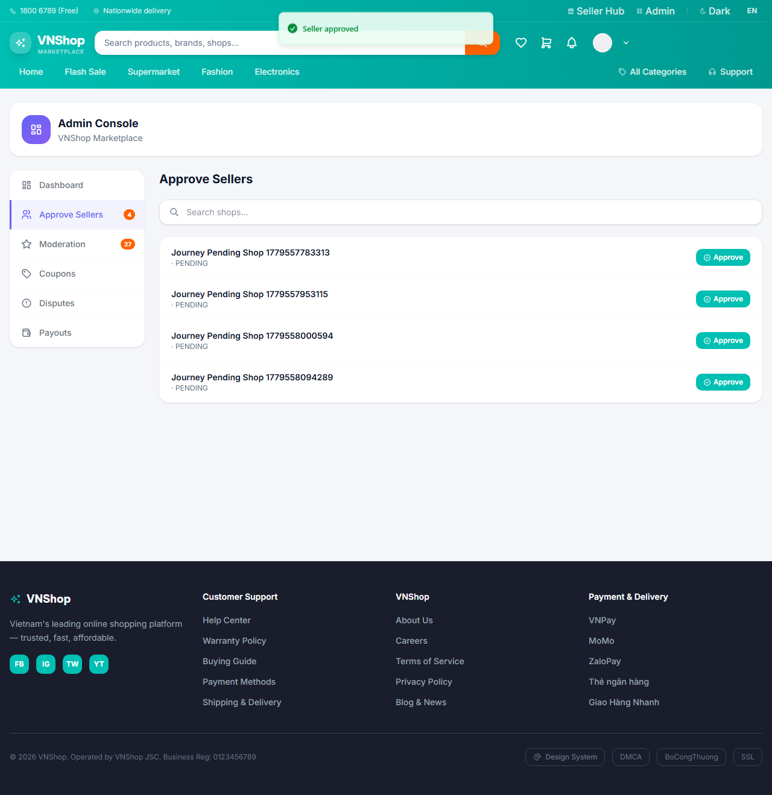
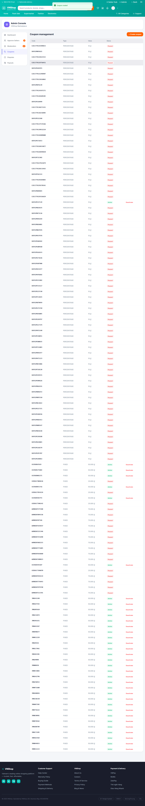

# Chapter 1 — Admin onboards the marketplace

**Persona:** admin
**Verdict:** PASS
**Generated:** 2026-05-23T19:35:17.286Z

## Business outcomes verified

| AC | Outcome | Status |
|---|---|---|
| AC-1.1 | Admin can review a pending seller's application and approve them | PASS |
| AC-1.2 | An approved seller appears in the public sellers list within 30 s | PASS |
| AC-1.3 | Admin can publish a fixed-discount coupon that is immediately redeemable at checkout | PASS |

## Stakeholder summary

All 3 acceptance criteria verified for the admin flow. No business-rule regressions detected this run.

## Steps (engineer view)

### 01. AC-1.1 — Admin opens the pending sellers queue and sees the new application — PASS

### 02. AC-1.1 — Admin clicks Approve and the application leaves the pending queue — PASS

### 03. AC-1.2 — Approved seller appears in the public sellers list within 30 s — PASS

### 04. AC-1.3 — Admin publishes coupon JRN912123 (50,000 VND fixed discount, 30-day TTL) — PASS

### 05. AC-1.3 — Admin logs out and the journey state is persisted for the next chapter — PASS

## Artifacts

- `trace.zip` — open with `npx playwright show-trace trace.zip`
- `video.webm` — full session recording (gitignored)
- `screenshots/` — one `NN-slug.png` per step, regenerated each run
