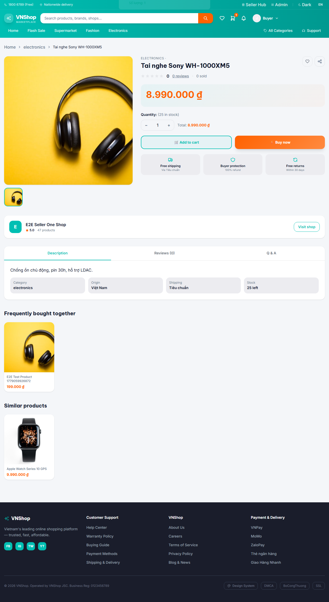
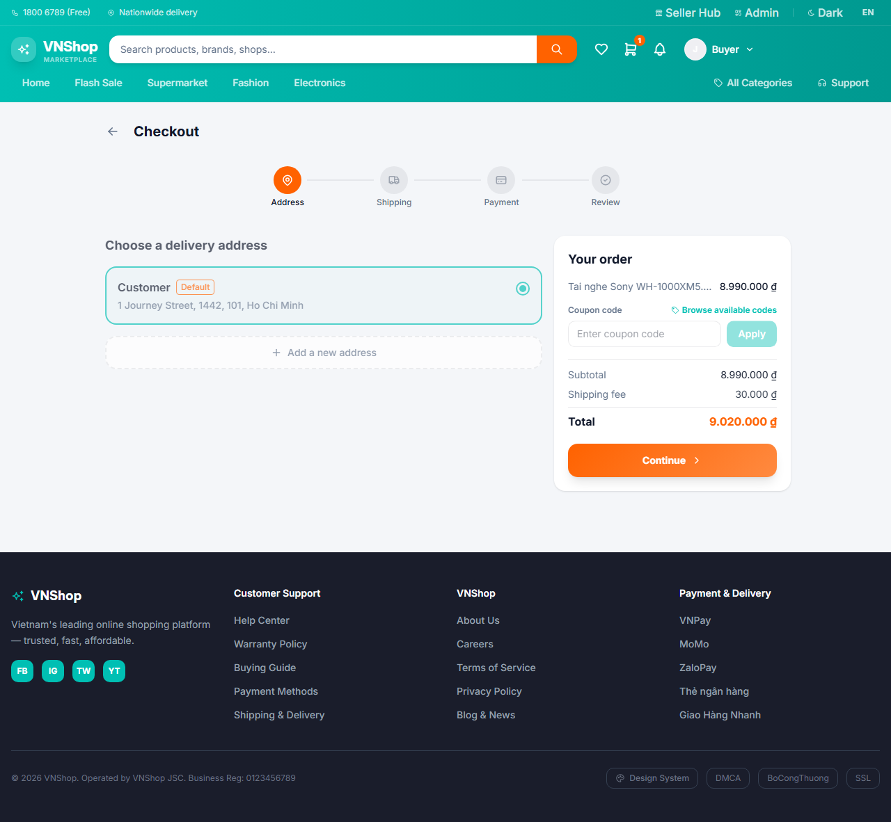
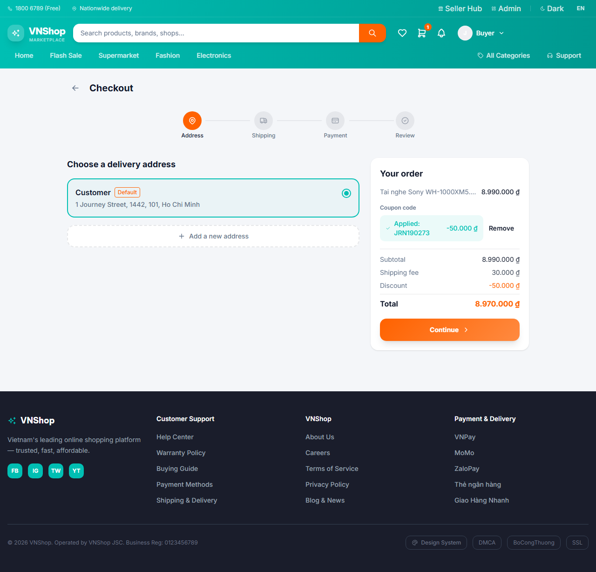
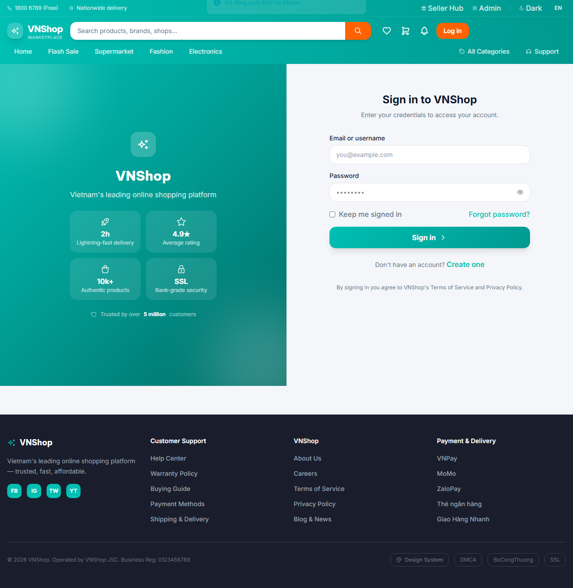

# Chapter 2 — Buyer discovers and orders

**Persona:** buyer
**Verdict:** PASS
**Generated:** 2026-05-23T21:20:02.557Z

## Business outcomes verified

| AC | Outcome | Status |
|---|---|---|
| AC-2.1 | A new visitor can register and start shopping in a single browser session | PASS |
| AC-2.2 | A coupon applied at checkout reduces the order total by exactly the published discount | PASS |
| AC-2.3 | A placed COD order is visible in the buyer's order history within 30 s | PASS |

## Stakeholder summary

All 3 acceptance criteria verified for the buyer flow. No business-rule regressions detected this run.

## Steps (engineer view)

### 01. AC-2.1 — Predecessor chapter has published a coupon (state.json check) — PASS

### 02. AC-2.1 — Visitor lands on the public store home page — PASS

### 03. AC-2.1 — Visitor registers a fresh buyer account and is signed in — PASS

### 04. AC-2.1 — Buyer opens a real seeded product and adds it to their cart — PASS

### 05. AC-2.2 — Buyer adds a delivery address and enters the checkout 4-step panel — PASS

### 06. AC-2.2 — Buyer captures the pre-coupon total shown on the checkout summary — PASS

### 07. AC-2.2 — Coupon applies and the discount line drops the total by exactly the published amount — PASS

### 08. AC-2.3 — Buyer places a COD order and receives a confirmation — PASS

### 09. AC-2.3 — Buyer's order history shows the new order and the chapter state is persisted — PASS

## Artifacts

- `trace.zip` — open with `npx playwright show-trace trace.zip`
- `video.webm` — full session recording (gitignored)
- `screenshots/` — one `NN-slug.png` per step, regenerated each run
