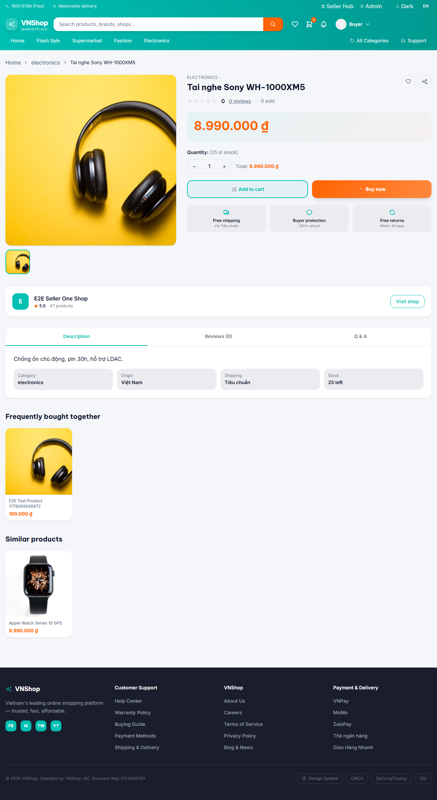

# Chapter 2 — Buyer discovers and orders

**Persona:** buyer
**Verdict:** FAIL
**Generated:** 2026-05-30T17:16:14.972Z

## Business outcomes verified

| AC | Outcome | Status |
|---|---|---|
| AC-2.1 | A new visitor can register and start shopping in a single browser session | PASS |
| AC-2.2 | A coupon applied at checkout reduces the order total by exactly the published discount | NOT_RUN |
| AC-2.3 | A placed COD order is visible in the buyer's order history within 30 s | NOT_RUN |
| AC-2.4 | A product the buyer can browse via /products is also discoverable via /search within 30 s — proves the kafka product-event → search-index projection is live | FAIL |

## Stakeholder summary

1 of 4 acceptance criteria passed for the buyer flow. Failed: AC-2.4 (A product the buyer can browse via /products is also discoverable via /search within 30 s — proves the kafka product-event → search-index projection is live).

## Steps (engineer view)

### 01. AC-2.1 — Predecessor chapter has published a coupon (state.json check) — PASS


### 02. AC-2.1 — Visitor lands on the public store home page — PASS


### 03. AC-2.1 — Visitor registers a fresh buyer account and is signed in — PASS


### 04. AC-2.1 — Buyer opens a real seeded product and adds it to their cart — PASS


### 05. AC-2.4 — Product is discoverable via /search within 30 s of being browsable on /products — FAIL



```
expected /search?q=Tai nghe Sony WH-1000XM5 to surface productId=2b0a8522-4310-4665-9874-bf37a5481667 within 30 s — search-index projection may be stale or kafka consumer disconnected

expected /search?q=Tai nghe Sony WH-1000XM5 to surface productId=2b0a8522-4310-4665-9874-bf37a5481667 within 30 s — search-index projection may be stale or kafka consumer disconnected

expect(received).toContain(expected) // indexOf

Expected value: "2b0a8522-4310-4665-9874-bf37a5481667"
Received array: []

Call Log:
- Timeout 30000ms exceeded while waiting on the predicate
```

## Artifacts

- `trace.zip` — open with `npx playwright show-trace trace.zip`
- `video.webm` — full session recording (gitignored)
- `screenshots/` — one `NN-slug.png` per step, regenerated each run
