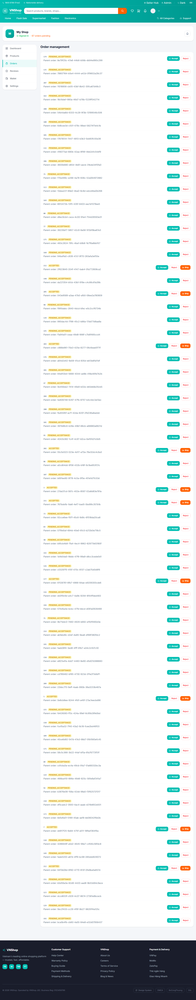
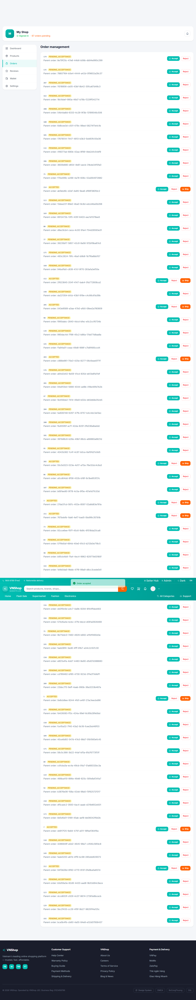
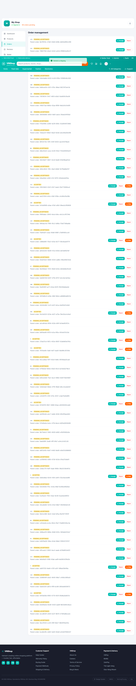
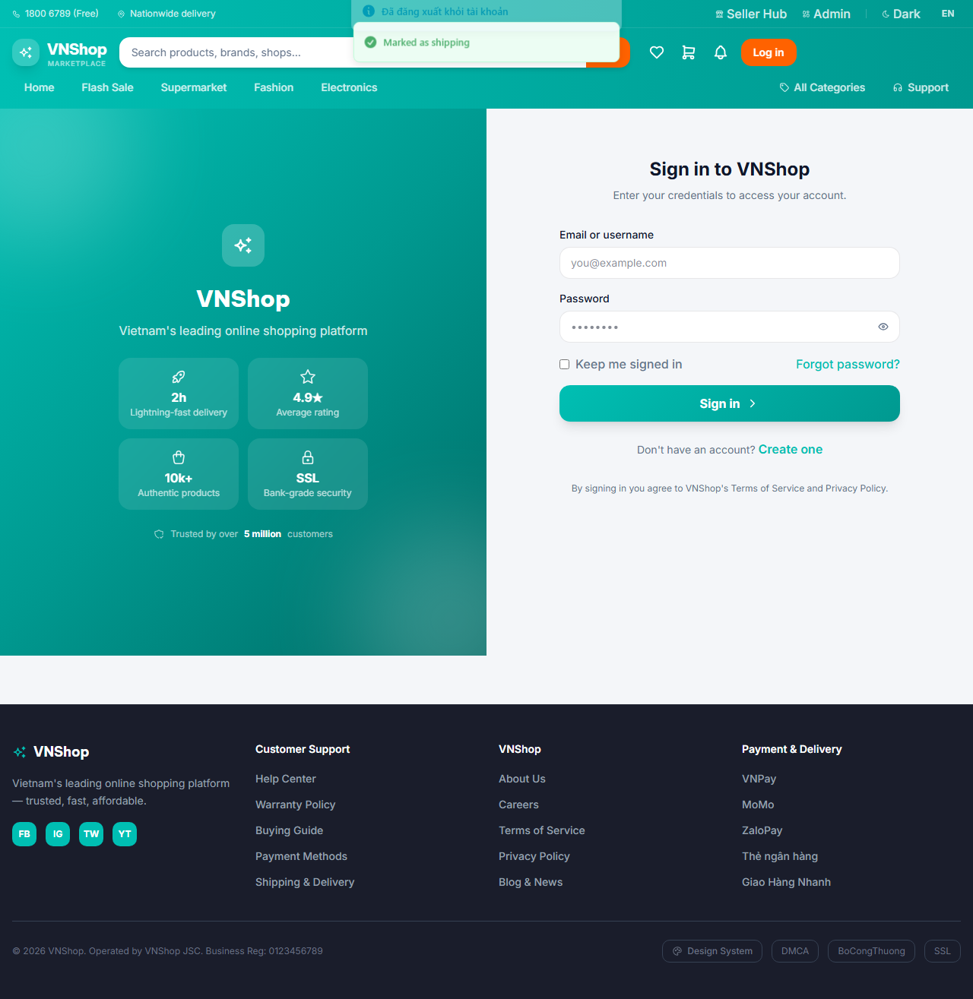

# Chapter 3 — Seller fulfills the order

**Persona:** seller
**Verdict:** PASS
**Generated:** 2026-05-23T21:27:08.400Z

## Business outcomes verified

| AC | Outcome | Status |
|---|---|---|
| AC-3.1 | A seller sees the buyer's new order in their pending queue within 30 s | PASS |
| AC-3.2 | A seller can accept and ship the order with a tracking number | PASS |

## Stakeholder summary

All 2 acceptance criteria verified for the seller flow. No business-rule regressions detected this run.

## Steps (engineer view)

### 01. AC-3.1 — Predecessor chapter has placed an order (state.json check) — PASS

### 02. AC-3.1 — Seller's pending queue includes Chapter 2's order within 30 s — PASS

### 03. AC-3.1 — Seller logs into the SPA and the Orders tab renders the pending row — PASS

### 04. AC-3.2 — Seller clicks Accept on the row and the toast confirms the round-trip — PASS

### 05. AC-3.2 — Seller ships the accepted order with a tracking number, summary toast confirms — PASS

### 06. AC-3.2 — Seller logs out and the journey state is persisted for the next chapter — PASS

## Artifacts

- `trace.zip` — open with `npx playwright show-trace trace.zip`
- `video.webm` — full session recording (gitignored)
- `screenshots/` — one `NN-slug.png` per step, regenerated each run
