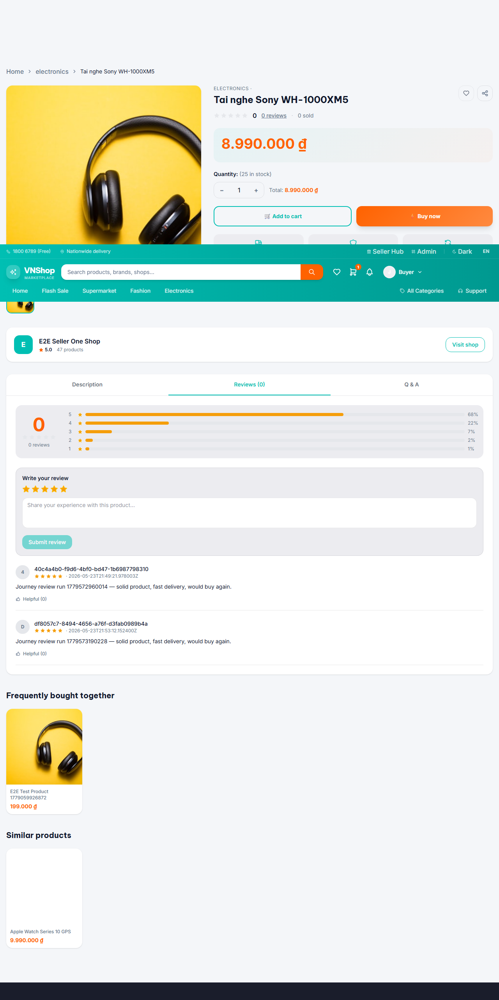
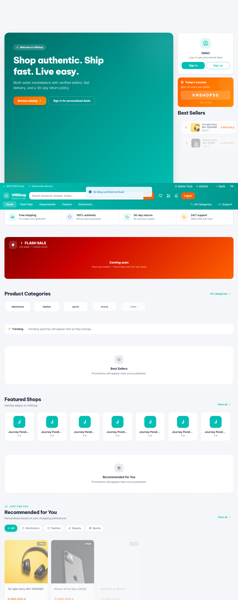

# Chapter 4 — Buyer reviews the ordered product

**Persona:** buyer
**Verdict:** PASS
**Generated:** 2026-05-23T21:53:14.578Z

## Business outcomes verified

| AC | Outcome | Status |
|---|---|---|
| AC-4.1 | Buyer who placed the order can return to their /orders history and see it | PASS |
| AC-4.2 | Buyer can submit a 5-star written review on the ordered product | PASS |
| AC-4.3 | Newly submitted review is visible on the public product page within 30 s | PASS |

## Stakeholder summary

All 3 acceptance criteria verified for the buyer flow. No business-rule regressions detected this run.

## Steps (engineer view)

### 01. AC-4.1 — Predecessor chapters left the buyer + product + order in state.json — PASS

### 02. AC-4.1 — Buyer logs back in and reaches /orders showing chapter 2's order — PASS

### 03. AC-4.2 — Buyer opens the product detail page for the ordered product — PASS

### 04. AC-4.2 — Buyer fills the review form and submits — success toast confirms — PASS

### 05. AC-4.3 — Newly submitted review is visible on the public product page within 30 s — PASS

### 06. AC-4.3 — Buyer logs out — chapter 4 leaves no new state for downstream chapters — PASS

## Artifacts

- `trace.zip` — open with `npx playwright show-trace trace.zip`
- `video.webm` — full session recording (gitignored)
- `screenshots/` — one `NN-slug.png` per step, regenerated each run
