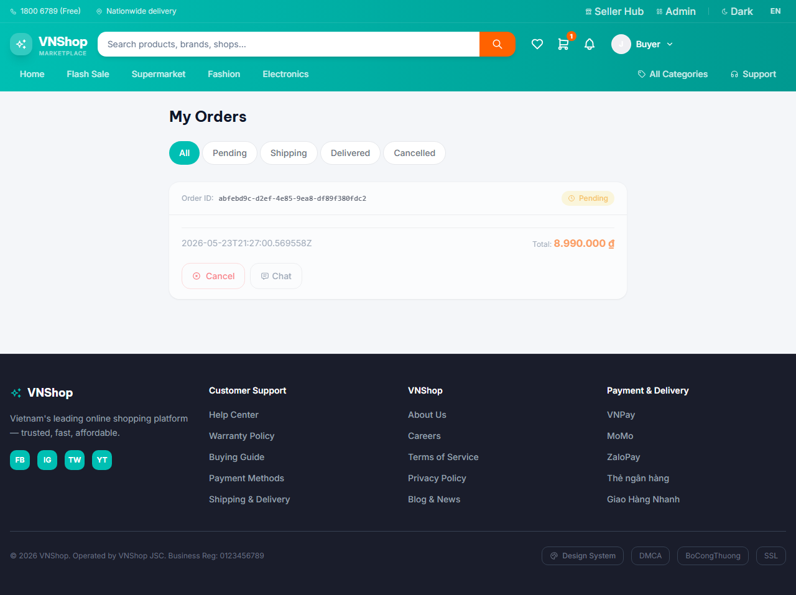
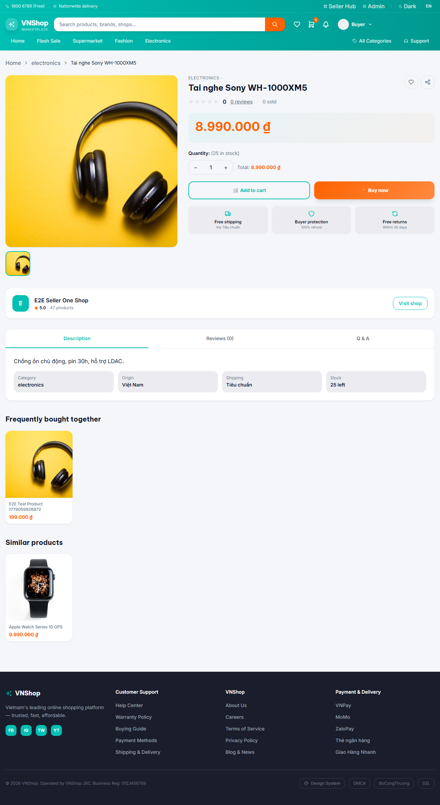
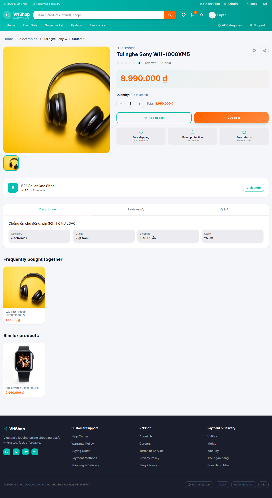

# Chapter 4 — Buyer reviews the ordered product

**Persona:** buyer
**Verdict:** FAIL
**Generated:** 2026-05-23T21:27:20.596Z

## Business outcomes verified

| AC | Outcome | Status |
|---|---|---|
| AC-4.1 | Buyer who placed the order can return to their /orders history and see it | PASS |
| AC-4.2 | Buyer can submit a 5-star written review on the ordered product | FAIL |
| AC-4.3 | Newly submitted review is visible on the public product page within 30 s | NOT_RUN |

## Stakeholder summary

1 of 3 acceptance criteria passed for the buyer flow. Failed: AC-4.2 (Buyer can submit a 5-star written review on the ordered product).

## Steps (engineer view)

### 01. AC-4.1 — Predecessor chapters left the buyer + product + order in state.json — PASS


### 02. AC-4.1 — Buyer logs back in and reaches /orders showing chapter 2's order — PASS



### 03. AC-4.2 — Buyer opens the product detail page for the ordered product — PASS



### 04. AC-4.2 — Buyer fills the review form and submits — success toast confirms — FAIL



```
expect(locator).toBeVisible() failed

Locator: locator('textarea').filter({ hasNot: locator('[disabled]') }).first()
Expected: visible
Timeout: 10000ms
Error: element(s) not found

Call log:
  - Expect "toBeVisible" with timeout 10000ms
  - waiting for locator('textarea').filter({ hasNot: locator('[disabled]') }).first()

```

## Artifacts

- `trace.zip` — open with `npx playwright show-trace trace.zip`
- `video.webm` — full session recording (gitignored)
- `screenshots/` — one `NN-slug.png` per step, regenerated each run
