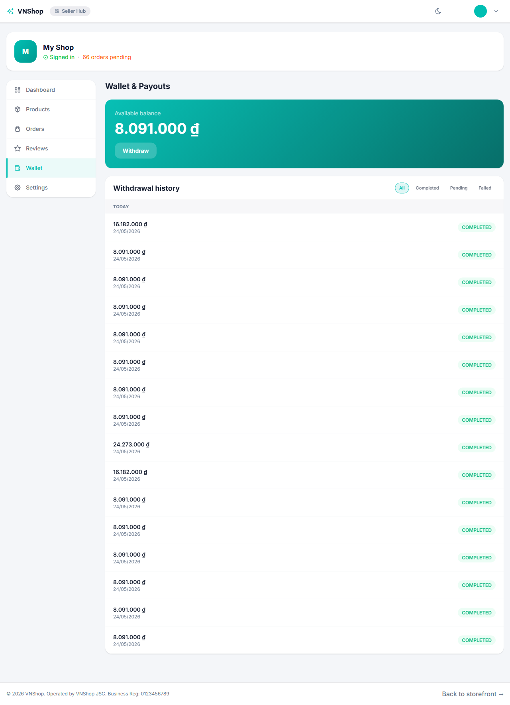
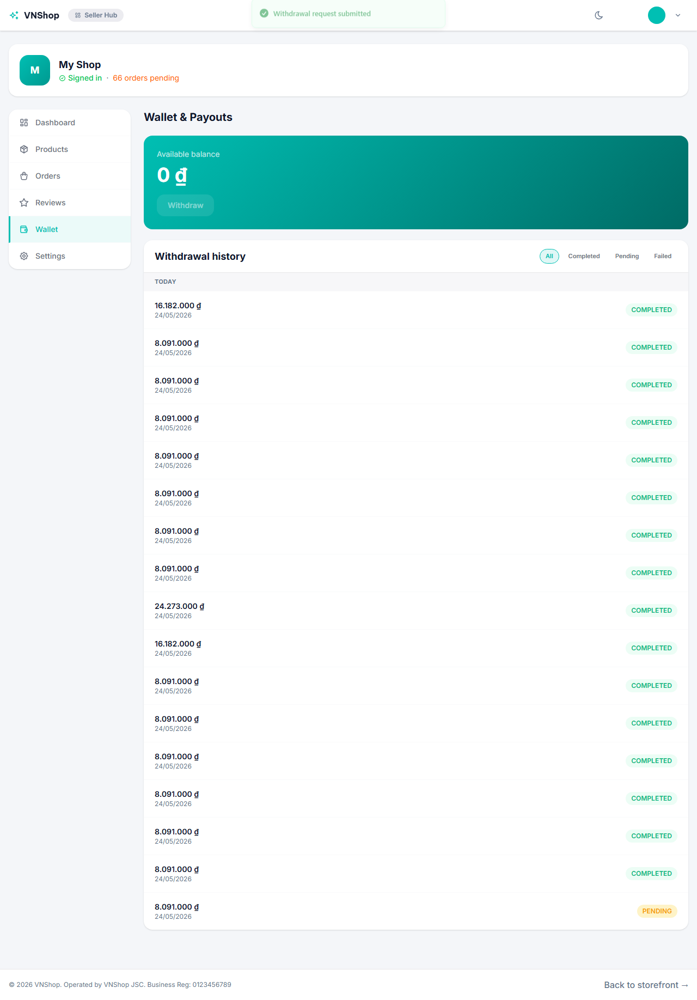
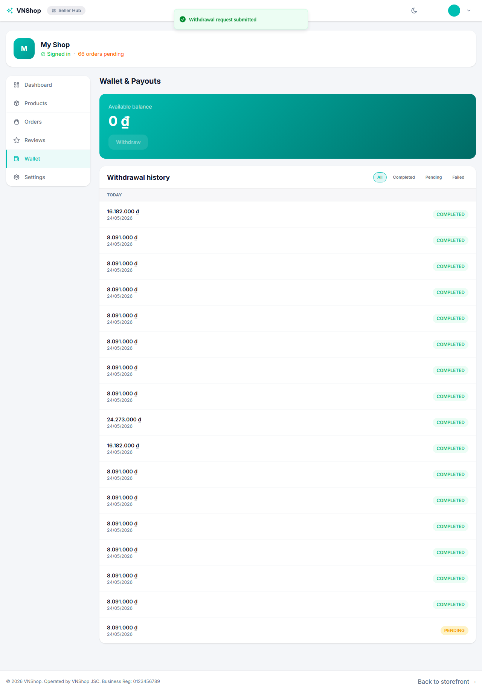
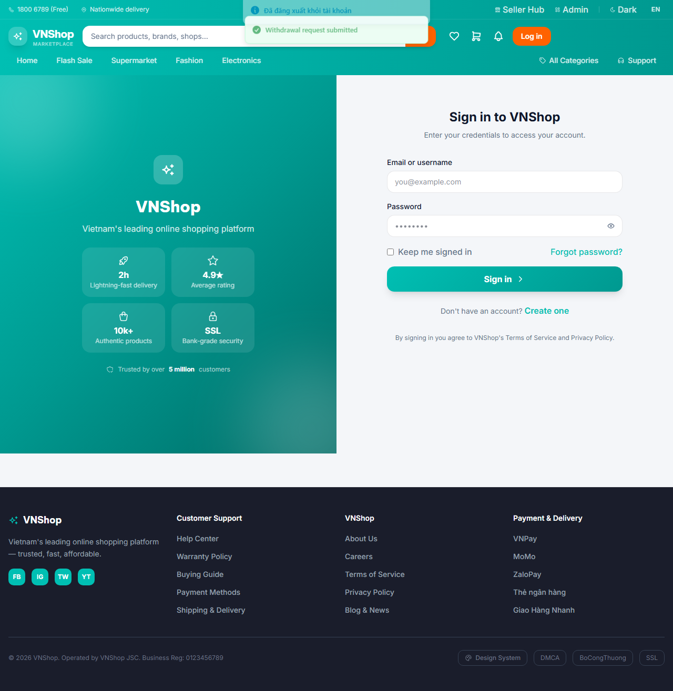

# Chapter 5 — Seller cashes out

**Persona:** seller
**Verdict:** PASS
**Generated:** 2026-05-24T15:14:02.711Z

## Business outcomes verified

| AC | Outcome | Status |
|---|---|---|
| AC-5.1 | Seller with positive wallet balance can submit a payout request | PASS |
| AC-5.2 | Submitted payout immediately appears in admin's pending payout queue | PASS |

## Stakeholder summary

All 2 acceptance criteria verified for the seller flow. No business-rule regressions detected this run.

## Steps (engineer view)

### 01. AC-5.1 — Predecessor chapters left a fulfilled order in state.json — PASS

### 02. AC-5.1 — Seller's wallet shows positive available balance from chapter 3's fulfillment — PASS

### 03. AC-5.1 — Seller logs into the SPA and the Wallet tab shows the same balance — PASS

### 04. AC-5.1 — Seller submits a payout request for the full balance (8091000 ₫) — PASS

### 05. AC-5.2 — Submitted payout appears in admin's pending payout queue — PASS

### 06. AC-5.2 — Seller logs out — chapter state persists payoutId for chapter 6 — PASS

## Artifacts

- `trace.zip` — open with `npx playwright show-trace trace.zip`
- `video.webm` — full session recording (gitignored)
- `screenshots/` — one `NN-slug.png` per step, regenerated each run
