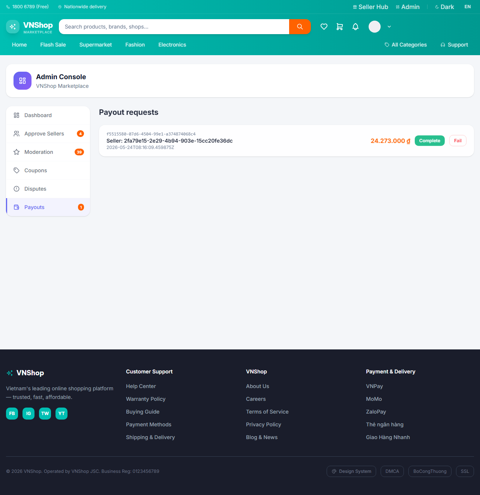
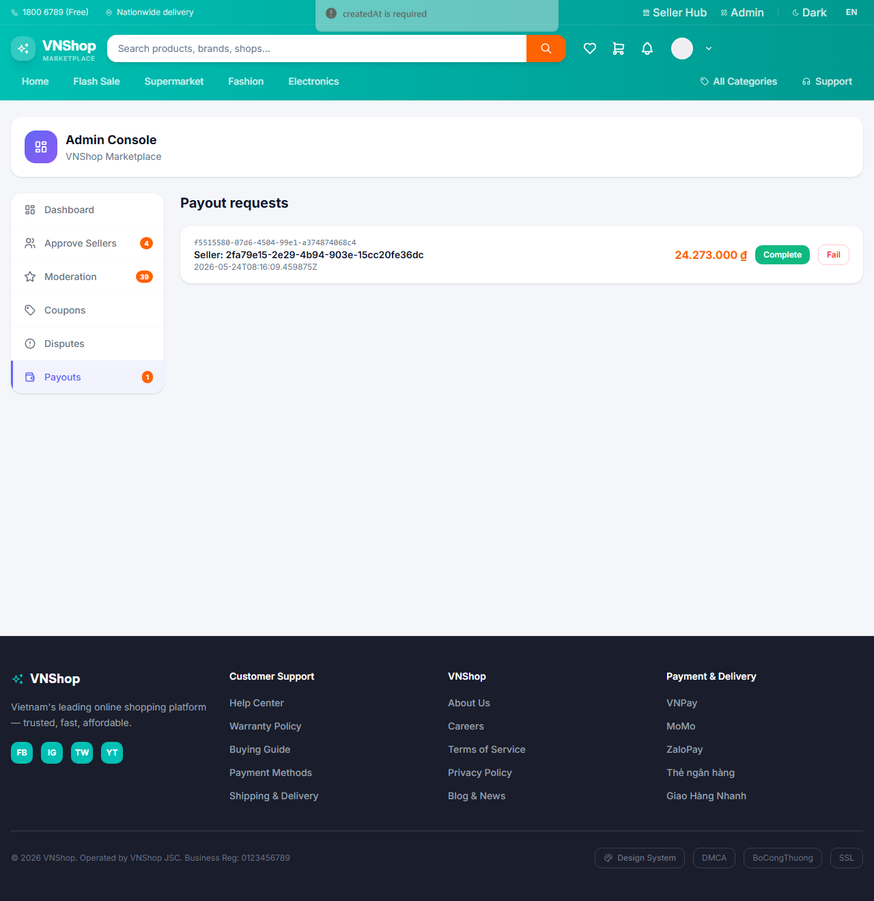
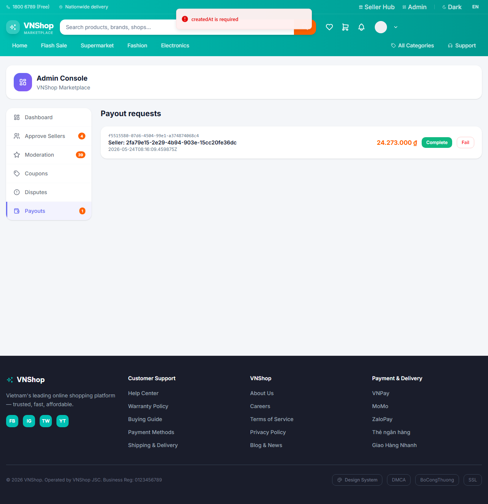
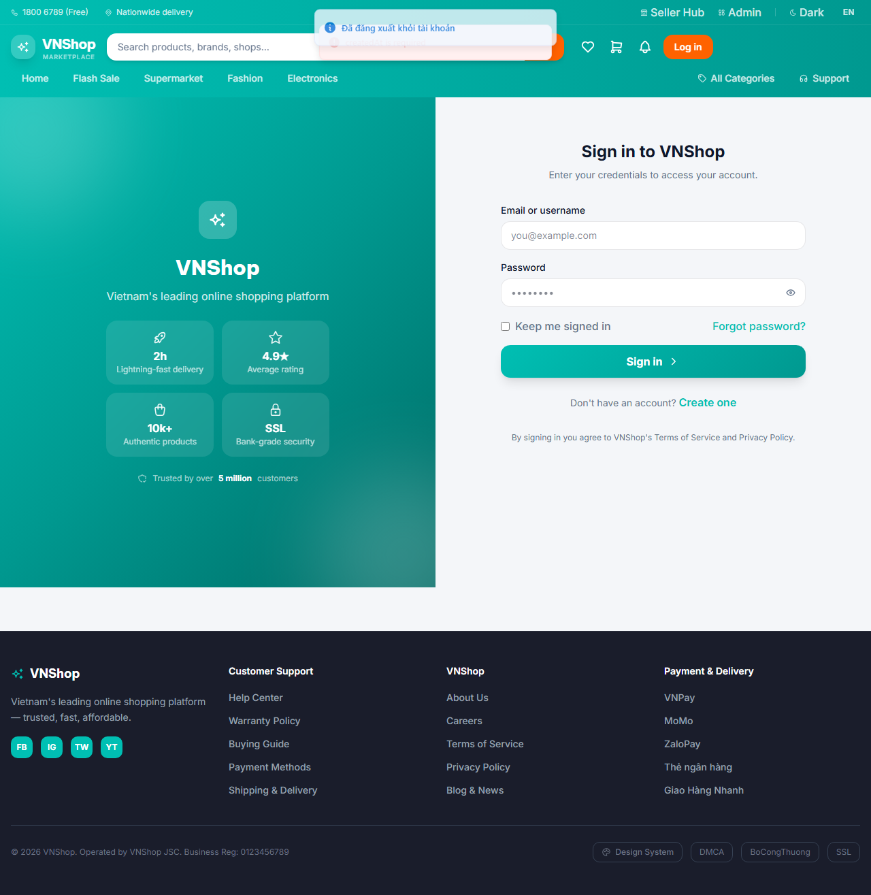

# Chapter 6 — Admin closes the loop

**Persona:** admin
**Verdict:** PASS
**Generated:** 2026-05-24T08:16:14.794Z

## Business outcomes verified

| AC | Outcome | Status |
|---|---|---|
| AC-6.1 | Admin's payout queue surfaces the seller's pending payout with the right amount | PASS |
| AC-6.2 | Admin can mark the payout complete and the payout leaves the pending queue | PASS |
| AC-6.3 | Seller's wallet pendingBalance drops by exactly the payout amount once the projection settles | PASS |

## Stakeholder summary

All 3 acceptance criteria verified for the admin flow. No business-rule regressions detected this run.

## Steps (engineer view)

### 01. AC-6.1 — Predecessor chapter 5 left a PENDING payoutId in state.json — PASS

### 02. AC-6.3 — Capture seller1's pendingBalance before admin closes the payout — PASS

### 03. AC-6.1 — Admin opens the Payouts tab and the seller's pending payout is listed — PASS

### 04. AC-6.2 — Admin clicks Complete on the row and the payout leaves the pending queue — PASS

### 05. AC-6.3 — Seller's pendingBalance drops by exactly the payout amount — PASS

### 06. AC-6.3 — Admin logs out — journey complete; chapter 6 leaves no new state — PASS

## Artifacts

- `trace.zip` — open with `npx playwright show-trace trace.zip`
- `video.webm` — full session recording (gitignored)
- `screenshots/` — one `NN-slug.png` per step, regenerated each run
