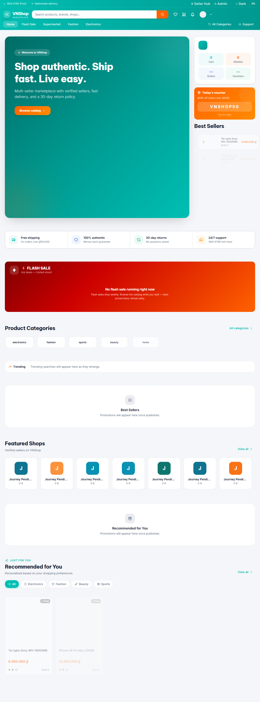
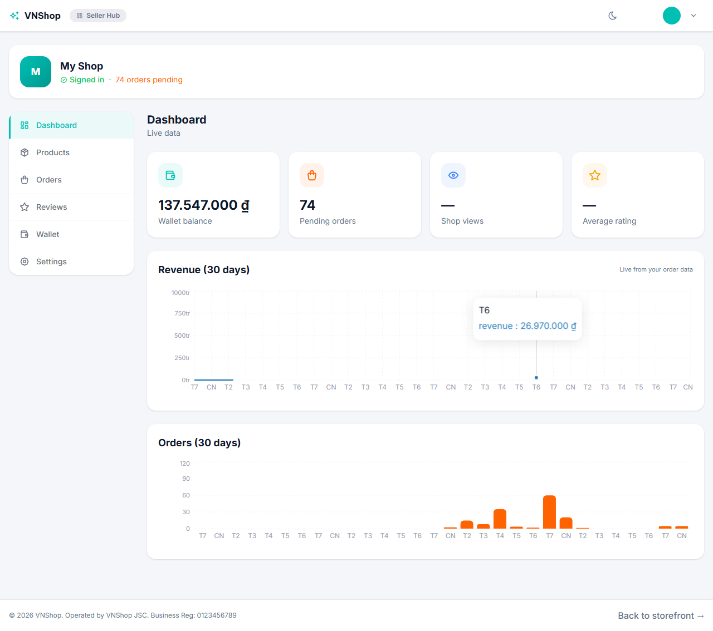
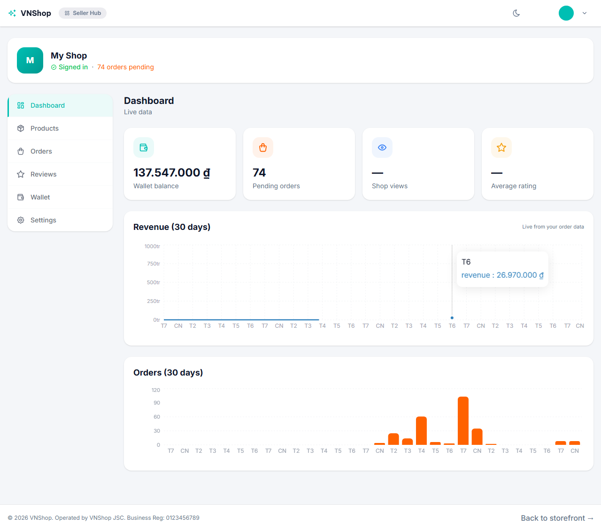
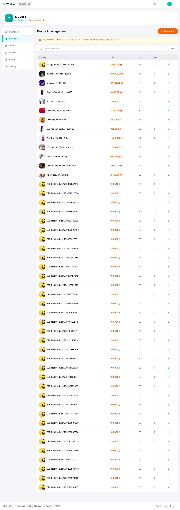
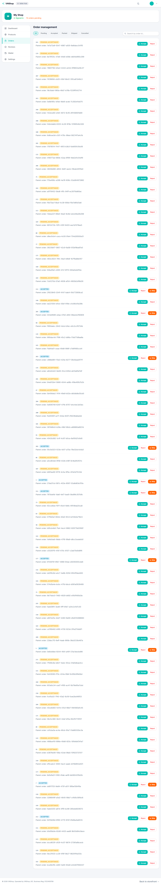
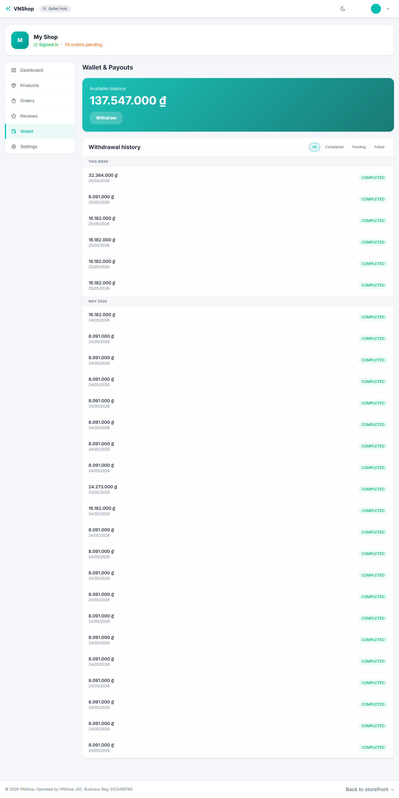
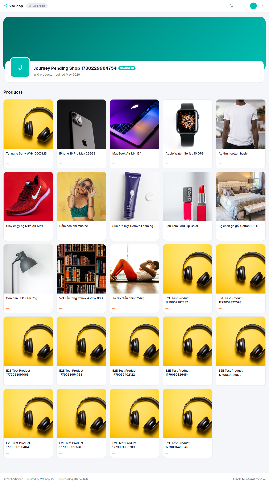
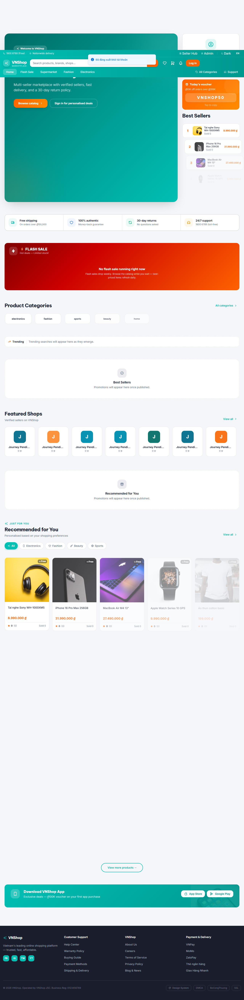

# Workday — Seller

**Verdict:** PASS
**Steps:** 8 / 8 passed
**Generated:** 2026-05-31T12:21:28.022Z

## Steps

### 01. Login as seller1 via /login form — PASS

### 02. /seller dashboard mounts with four KPI cards — PASS

### 03. Revenue + Orders 30-day sections render — PASS

### 04. Products tab table chrome renders — PASS

### 05. Orders tab queue parses without Zod leak — PASS

### 06. Wallet tab renders balance + history sections — PASS

### 07. View own public storefront at /sellers/{id} — PASS

### 08. Logout returns to home with Login CTA — PASS

## Artifacts

- `trace.zip` — open with `npx playwright show-trace trace.zip`
- `video.webm` — full session recording (gitignored)
- `screenshots/` — one `NN-slug.png` per step, regenerated each run
